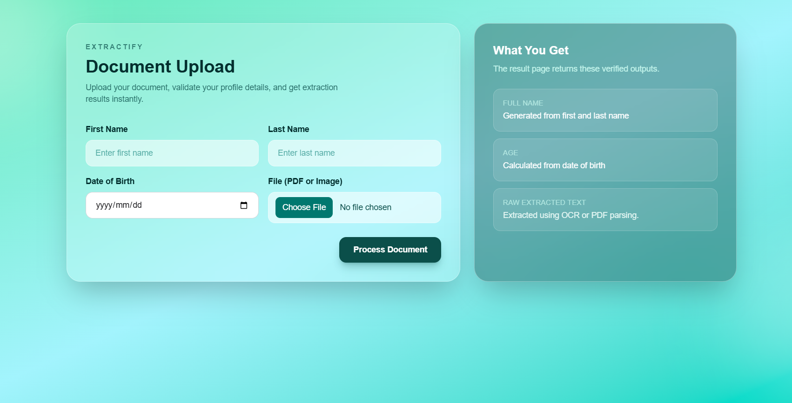
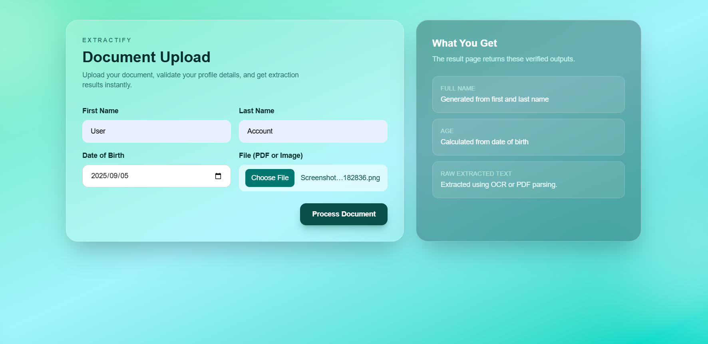
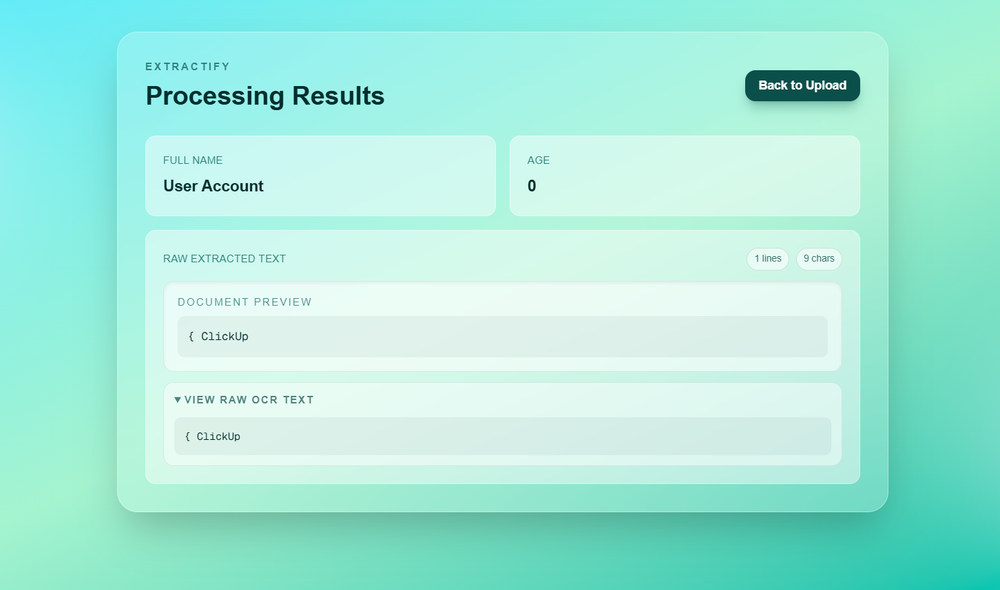

# Extractify

Extractify is a full-stack assessment project that accepts a PDF or image upload, extracts raw text from the document, calculates age from the submitted date of birth, and displays the processed result in a clean Next.js UI.

## Tech Stack

- Frontend: Next.js (App Router), TypeScript, Tailwind CSS
- Backend: Express.js, Multer
- Text extraction:
  - `pdf-parse` for PDF files
  - `tesseract.js` for image files

## Features

- Upload form with:
  - First name
  - Last name
  - Date of birth
  - File input (PDF/image)
- API endpoint: `POST /api/upload`
- API response includes:
  - `fullName`
  - `age`
  - `rawExtractedText`
- Result page displays extracted output with a readable preview.
- `rawExtractedText` is returned as raw output from `pdf-parse`/`tesseract.js`.

## Project Structure

```txt
extractify_app/
├─ server/
│  └─ index.mjs           # Express API server
├─ src/
│  └─ app/
│     ├─ page.tsx         # Upload page
│     ├─ result/page.tsx  # Result page
│     ├─ layout.tsx
│     └─ globals.css
├─ package.json
└─ README.md
```

## Setup

1. Install dependencies:

```bash
npm install
```

2. Start the API server:

```bash
npm run dev:api
```

3. Start the frontend app in another terminal:

```bash
npm run dev
```

## Local URLs

- Frontend: `http://localhost:3000`
- API: `http://localhost:4000`
- API health check: `http://localhost:4000/api/health`

## API Contract

### `POST /api/upload`

Accepts `multipart/form-data`:

- `firstName` (string, required)
- `lastName` (string, required)
- `dateOfBirth` (YYYY-MM-DD, required)
- `file` (PDF or image, required)

Example success response:

```json
{
  "fullName": "Jane Doe",
  "age": 28,
  "rawExtractedText": "..."
}
```

Notes:
- `rawExtractedText` can be noisy for low-quality images; this is expected OCR behavior.
- For best extraction quality, use high-resolution document images or PDF files.

## Environment

The frontend reads the API base URL from:

- `NEXT_PUBLIC_API_URL` (optional, defaults to `http://localhost:4000`)

## Testing Checklist

- [ ] Upload a PDF and confirm extracted text appears on result page
- [ ] Upload an image and confirm OCR text appears on result page
- [ ] Validate age calculation from date of birth
- [ ] Confirm validation errors for missing required fields

## Screenshots

Upload page:



Filled upload form:



Result page:



